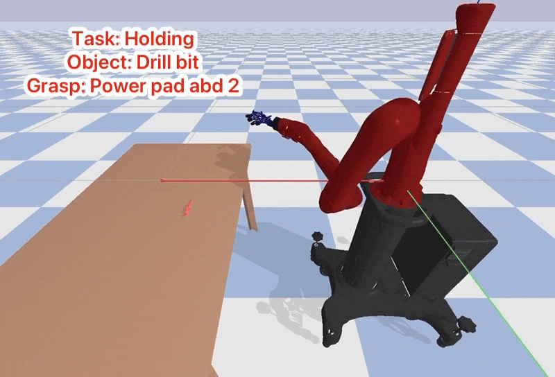
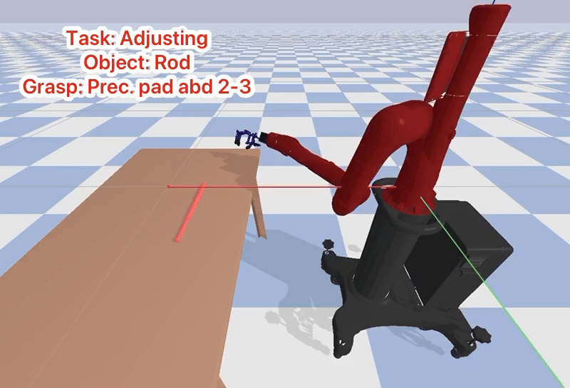
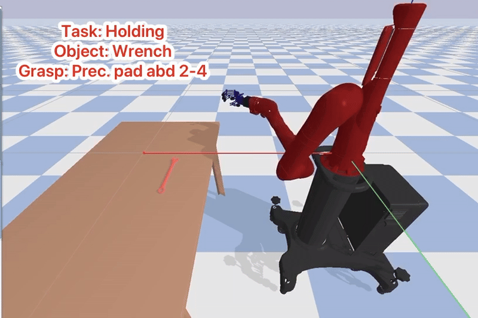
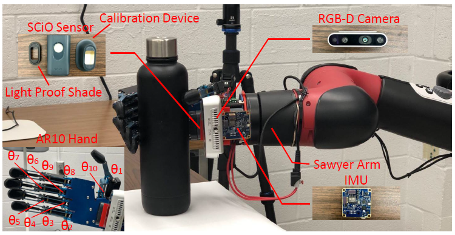
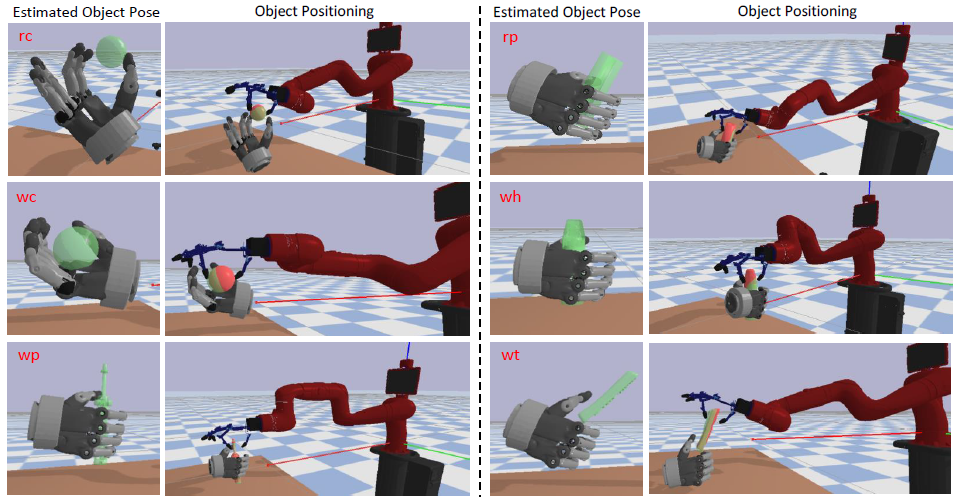
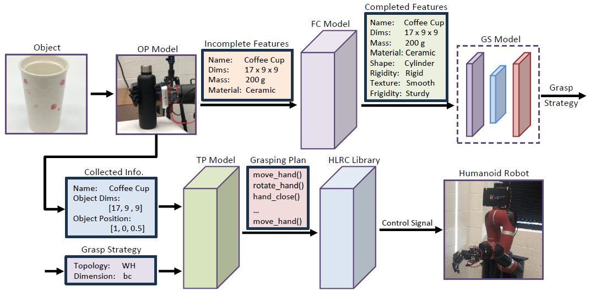
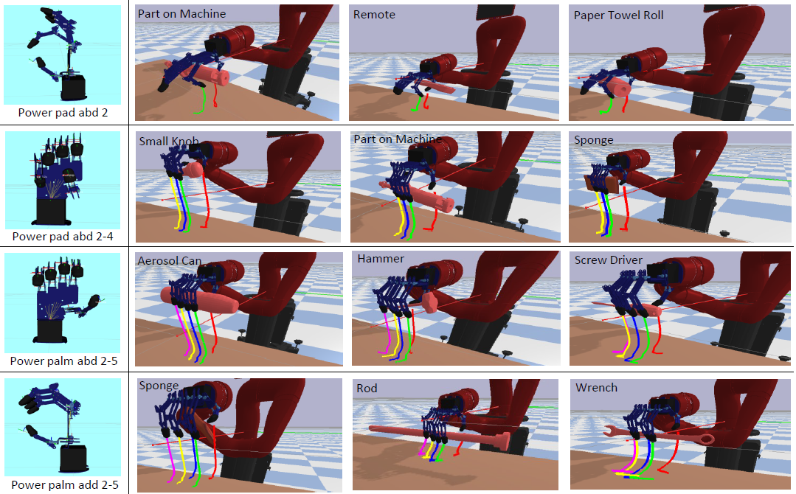
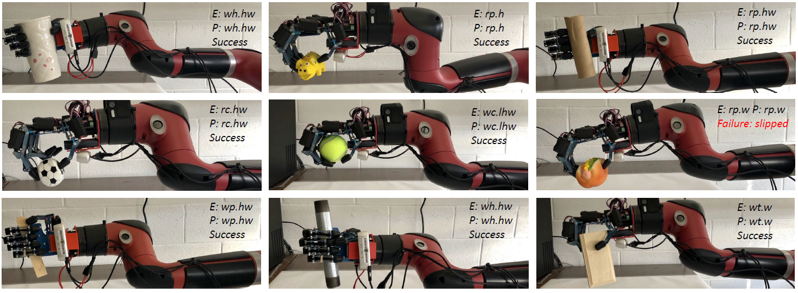
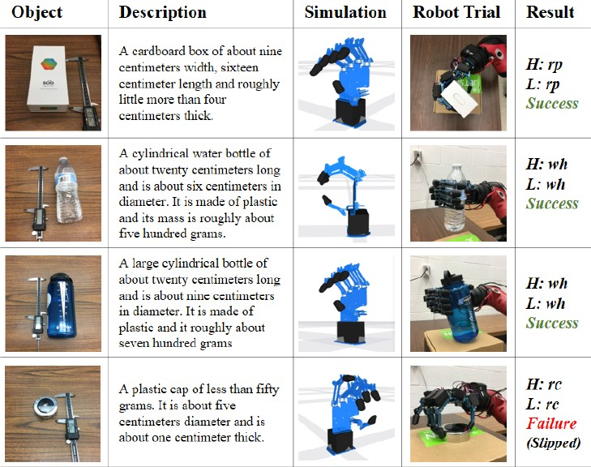
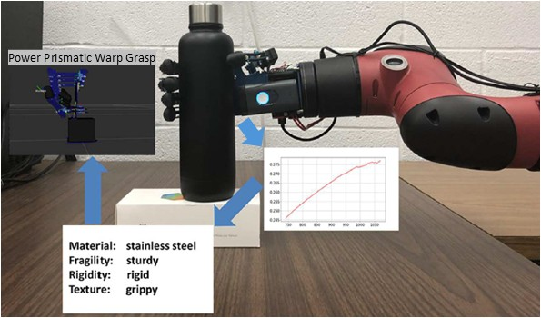

# Overview

This repository includes the simulation environment for the MagicHand platform, a task-object grasp dataset, and the source code for two reinforcement learning models designed for object grasping and object alignment tasks.

 

If you find this environment helpful, please consider cite

    @inproceedings{li2020magichand,
      title={MagicHand: Context-Aware Dexterous Grasping Using an Anthropomorphic Robotic Hand},
      author={Li, Hui and Tan, Jindong and He, Hongsheng},
      booktitle={2020 IEEE International Conference on Robotics and Automation (ICRA)},
      pages={9895--9901},
      year={2020},
      organization={IEEE}
    }

# MagicHand
The MagicHand platform is a context-aware dexterous manipulation system comprising a Sawyer robotic arm and an AR10 robotic hand. It integrates multiple sensors, including a RealSense RGB-D camera, a SCiO sensor for near-infrared (NIR) perception, and an inertial measurement unit (IMU).

 

The simulation environment is developed using PyBullet within the Gym framework. It supports reinforcement learning and enables a range of applications, including object alignment, pick-and-place, and dexterous manipulation tasks.

# Task-Oriented Objects Dataset
This dataset was revised from the Yale human grasping dataset. It contains human knowledge representation of 6554 grasping tasks.

 

# Publications

This platform has been utilized in the following publications

## Grasp Intention Interpretation in Object Handover for Human-Robot Teaming
This paper introduces a grasp adaptation algorithm that enables social robots to recognize and adjust to individual human grasping habits, enhancing the safety and fluidity of object handovers. By extracting 3D key points from RGB images and classifying them into six standard grasp topologies, the system estimates object pose and uses reinforcement learning to optimize the handover process.

 

    @inproceedings{li2024grasp,
    title={Grasp Intention Interpretation in Object Handover for Human-Robot Teaming},
    author={Li, Hui and Uz Zaman, Akhlak and He, Hongsheng},
    booktitle={International Conference on Social Robotics},
    pages={346--354},
    year={2024},
    organization={Springer}
    }
[[download paper](https://link.springer.com/chapter/10.1007/978-981-96-1151-5_35)]

## Knowledge Augmentation and Task Planning in Large Language Models for Dexterous Grasping
This paper presents a Cognition-Based Grasping System that enhances dexterous grasping by integrating high-level cognitive processes. Unlike existing approaches that rely heavily on object datasets and learning-based planning, this system incorporates perception, reasoning, and intuition using a Large Language Model to infer missing object information through common sense. It then learns and executes appropriate grasp strategies.

 

    @inproceedings{li2023knowledge,
    title={Knowledge Augmentation and Task Planning in Large Language Models for Dexterous Grasping},
    author={Li, Hui and Tran, Dang and Zhang, Xinyu and He, Hongsheng},
    booktitle={2023 IEEE-RAS 22nd International Conference on Humanoid Robots (Humanoids)},
    pages={1--8},
    year={2023},
    organization={IEEE}
    }

[[download paper](https://ieeexplore.ieee.org/document/10375176)]

## Learning Task-Oriented Dexterous Grasping from Human Knowledge
This paper proposes a task-oriented dexterous grasping framework that enables robots to learn and adapt grasp strategies based on human experience, object affordances, and task requirements. Grasp topologies are defined and learned from a task-oriented dataset, while a reinforcement learning-based policy enables context-aware strategy deployment. Evaluated using a simulated environment with an AR10 hand on a Sawyer robot, the system achieved a 100% hit rate for grasp strategies, a 95.6% top-3 match rate, and an 85.6% grasp success rate across 2,700 manipulation tasks guided by natural-language instructions.

 

    @inproceedings{li2021learning,
      title={Learning Task-Oriented Dexterous Grasping from Human Knowledge},
      author={Li, Hui and Zhang, Yinlong and Li, Yanan and He, Hongsheng},
      booktitle={2021 IEEE International Conference on Robotics and Automation (ICRA)},
      pages={6192--6198},
      year={2021},
      organization={IEEE}
    }

[[download paper](https://ieeexplore.ieee.org/abstract/document/9562073)]

## MagicHand: Context-Aware Dexterous Grasping Using an Anthropomorphic Robotic Hand

This paper presents a context-aware anthropomorphic robotic hand system, MagicHand, which gathers multimodal information about target objects and generates appropriate grasping strategies accordingly. The system leverages Near-Infrared (NIR) spectroscopy to recognize material properties at the molecular level and uses RGB-D images to estimate object dimensions. Six commonly used grasping poses are defined, and the system selects the most suitable grasp strategy based on the perceived object characteristics.

 

    @inproceedings{li2020magichand,
      title={MagicHand: Context-Aware Dexterous Grasping Using an Anthropomorphic Robotic Hand},
      author={Li, Hui and Tan, Jindong and He, Hongsheng},
      booktitle={2020 IEEE International Conference on Robotics and Automation (ICRA)},
      pages={9895--9901},
      year={2020},
      organization={IEEE}
    }

[[download paper](https://ieeexplore.ieee.org/document/9196538)]

## Learning robotic grasping strategy based on natural-language object descriptions
This paper presents a learning-based approach for determining grasping strategies for an anthropomorphic robotic hand using natural-language descriptions of objects. A customized natural language processing technique is used to extract object features, which are then mapped to appropriate grasp types based on a human grasp taxonomy. The proposed method is evaluated through both simulation and real-world experiments using an AR10 robotic hand, demonstrating its effectiveness in generating suitable grasp strategies from linguistic input.

 

    @inproceedings{rao2018learning,
      title={Learning robotic grasping strategy based on natural-language object descriptions},
      author={Rao, Achyutha Bharath and Krishnan, Krishna and He, Hongsheng},
      booktitle={2018 IEEE/RSJ International Conference on Intelligent Robots and Systems (IROS)},
      pages={882--887},
      year={2018},
      organization={IEEE}
    }

[[download paper](https://ieeexplore.ieee.org/document/8593886)]

## Magichand: In-hand perception of object characteristics for dexterous manipulation

This paper addresses a key challenge in dexterous grasping: perceiving object characteristics such as fragility, rigidity, texture, mass, and density. A novel method is proposed that classifies Near-Infrared (NIR) spectra to identify object materials and infer their physical properties using a material-to-characteristics lookup table. NIR data from six materials—ceramic, stainless steel, wood, cardboard, plastic, and glass—were collected using a SCiO sensor and classified using a Multi-Layer Perceptron (MLP) neural network, achieving 99.96% accuracy. A grasping experiment with objects of similar shape but different materials demonstrated that the robotic hand could adapt its grasp strategy based on the perceived material characteristics, validating the effectiveness of the proposed approach.

 

    @inproceedings{li2018magichand,
      title={Magichand: In-hand perception of object characteristics for dexterous manipulation},
      author={Li, Hui and Yihun, Yimesker and He, Hongsheng},
      booktitle={Social Robotics: 10th International Conference, ICSR 2018},
      pages={523--532},
      year={2018},
      organization={Springer}
    }

[[download paper](https://link.springer.com/chapter/10.1007/978-3-030-05204-1_51)]